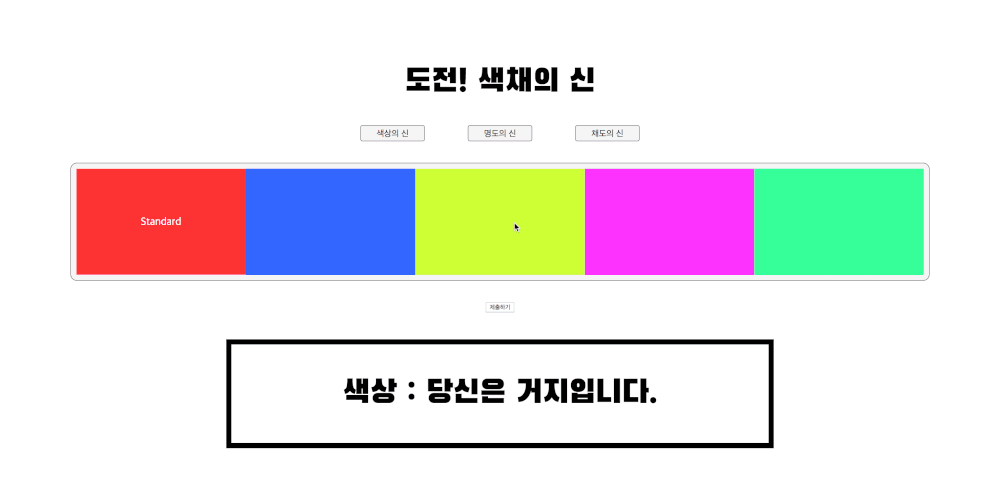

# [도전! 색채의 신](https://kimkyeseung.github.io/Color-Puzzle/)
### 블록을 드래그하여 퍼즐을 맞추세요!

## Introduction
색에는 세 가지 속성(색상, 채도, 명도)가 있습니다.

각 속성 별로 퍼즐을 맞추는 간단한 퍼즐 게임입니다.

## Tryout
<https://kimkyeseung.github.io/Color-Puzzle/>{: target="_blank" }

